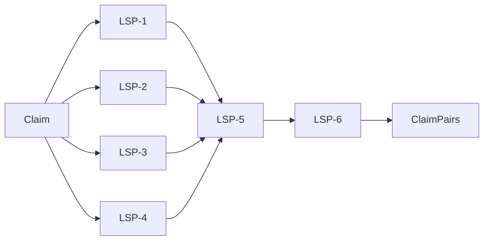

# EvidenceSeeker App Boilerplate


### Logico-Semantic Pre-Processing



```yaml
- name: LSP-1
  description: |
    Instruct the assistant to carry out free-text analysis of normative content.
  prompt: |
    The following claim has been submitted for fact-checking.
    <claim>{claim}</claim>
    Before we proceed with retrieving evidence items, we carefully analyse the claim. Your task is to contribute to this preparatory analysis, as detailed below.
    In particular, you should  
    1. thoroughly discuss whether the claim contains or implies normative statements, such as value judgements, recommendations, or evaluations -- if so, try to identify them and render them in your own words;
    2. watch out for ambiguity and vagueness during your discussion, making alternative interpretations explicit.
- name: LSP-2
  description: |
    Instruct the assistant to carry out free-text analysis of factual content.
  prompt: |
    The following claim has been submitted for fact-checking.
    <claim>{claim}</claim>
    Before we proceed with retrieving evidence items, we carefully analyse the claim. Your task is to contribute to this preparatory analysis, as detailed below.
    In particular, you should  
    1. thoroughly discuss whether the claim contains or implies factual or descriptive statements, which can be verified or falsified by empirical observation or scientific analysis and which may include, for example, descriptive reports, historical facts, or scientific claims -- if so, try to identify them and render them in your own words;
    2. watch out for ambiguity and vagueness during your discussion, making alternative interpretations explicit.
- name: LSP-3
  description: |
    Instruct the assistant to carry out free-text analysis of ascriptions.
  prompt: |
    The following claim has been submitted for fact-checking.
    <claim>{claim}</claim>
    Before we proceed with retrieving evidence items, we carefully analyse the claim. Your task is to contribute to this preparatory analysis, as detailed below.
    In particular, you should  
    1. thoroughly discuss whether the claim contains ascriptions, that is, whether the claim ascribes a statement to a person or organisation (e.g., as something person has said, believes, acts on etc.) rather than plainly asserting it, where  -- if so, try to identify which statements are ascribed to whom exactly and in which ways;
    2. watch out for ambiguity and vagueness during your discussion, making alternative interpretations explicit.
- name: LSP-4
  description: |
    Instruct the assistant to carry out free-text analysis of uncertainty.
  prompt: |
    The following claim has been submitted for fact-checking.
    <claim>{claim}</claim>
    Before we proceed with retrieving evidence items, we carefully analyse the claim. Your task is to contribute to this preparatory analysis, as detailed below.
    In particular, you should  
    1. thoroughly discuss the strength of the claim, that is, whether the claim unequivocally states a proposition a true (or false), or whether it's content is more nuanced, e.g. by including modal qualifiers, such as "might", "could", "probably", "possibly", "likely", "unlikely", "certainly", "impossible", etc. -- if so, try to describe the quality and stremgth of the claim as clearly as possible;
    2. watch out for ambiguity and vagueness during your discussion, making alternative interpretations explicit.
- name: LSP-5
  description: |
    Instruct the assistant to identify the normative content, the factual assertion, and the ascriptions contained in a claim.
  prompt: |
    The following claim has been submitted for fact-checking.
    <claim>{claim}</claim>
    Building on our previous analysis, I want you to to identify the normative, the factual, and the ascriptive content in the claim. In particular, you should  
    1. List all normative statements, such as value judgements, recommendations, or evaluations, contained in the claim;
    2. List all factual or descriptive statements, which can be verified or falsified by empirical observation or scientific analysis, contained in the claim;
    3. List all ascriptions, that is, statements ascribed to a person or organisation, contained in the claim.
- name: LSP-6
  description: |
    Instruct assistant to negate the factual and ascriptive claims.
  prompt: |
    The following claim has been submitted for fact-checking.
    <claim>{claim}</claim>
    That claim contains the following factual and ascriptive statements:
    <factual>{factual}</factual>
    <ascriptive>{ascriptive}</ascriptive>
    Your task is to provide the opposite of each of these statement in clear and unequivocal language. Do so by generating a list of statements that express these negations.
```

### Evidence Retrieval

Do [recursive retrieval](https://docs.llamaindex.ai/en/stable/examples/retrievers/auto_vs_recursive_retriever/) of documents to find relevant evidence items for each clarified claim and its negation.

### Evidential Confirmation Analysis

We frame confirmation analysis as a rich textual entailment task. We assess the degree to which a single evidence item (retrieved in previous step):

1. entails the claim, and
2. entails the negation of the claim.

This gives us a degree of confirmation of the claim by the evidence item, which ranges between -1 and 1.

We do this for each evidence item retrieved and each claim.


### Evidence Aggregation

For each claim, we aggregate:

```json
{
    "claim_id": "claim_id",  
    "n_evidence": 823, // number of relevant evidence items found
    "degree_of_confirmation": -0.21, // average degree of confirmation of the claim by the evidence items
    "evidential_uncertainty": .32, // variance of degrees of confirmation
}
```

and **verbalize** these results.
